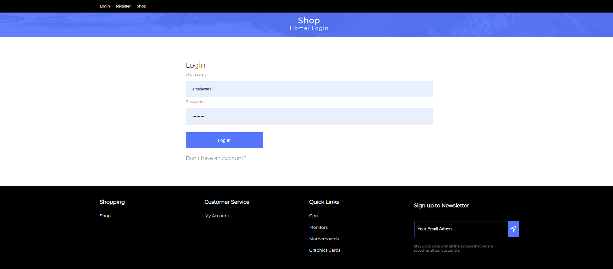
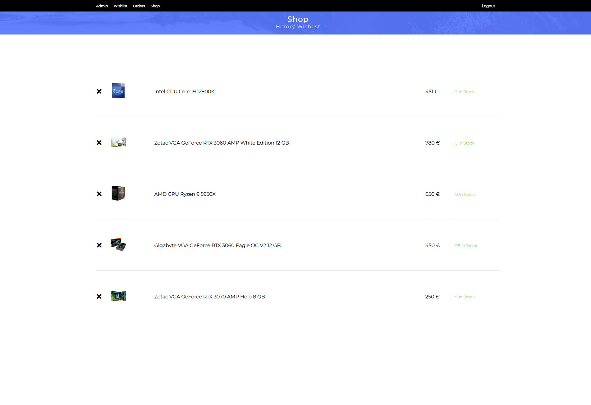
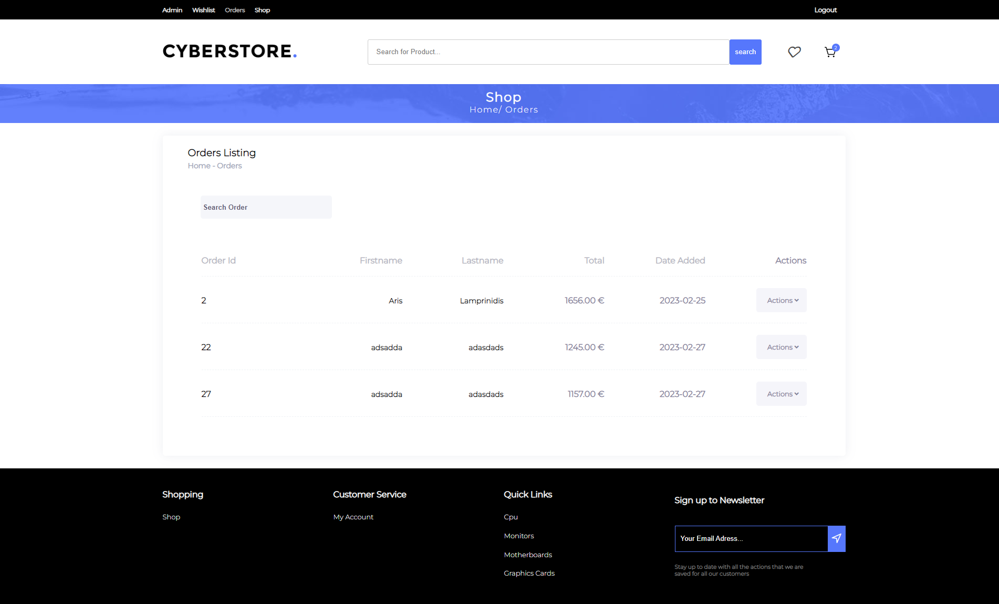

<b>Cyberstore</b> is an e-commerce website that allows users to buy computer hardware parts.

It provides a fully functional login/register system and implements the roles of admin and customer. Once a user is logged in, they have the following options at their disposal:
  - Favourite Products
  - Add Products to Cart
  - Pay for a Product
  - View previous order details ( once payment is done)
  - Search for products and sort them by category/price
  - Contact page
  - Subscribe to a newsletter

Admin has his own dashboard, where he can analyze the performance of the website with the help of charts, insert/edit new products and view all the products of the website.

<b>Technologies:<b/>
    Html | Css | Javascript | ASP.NET MVC | Entity Framework | C# | Jquery | Sql

    
<h3>Homepage</h3>

<h3>Login</h3>

<h3>Cart</h3>

    
<h3>Checkout</h3>

    
<h3>Wishlist</h3>

    
<h3>Orders</h3>

<h3>Admin</h3>

